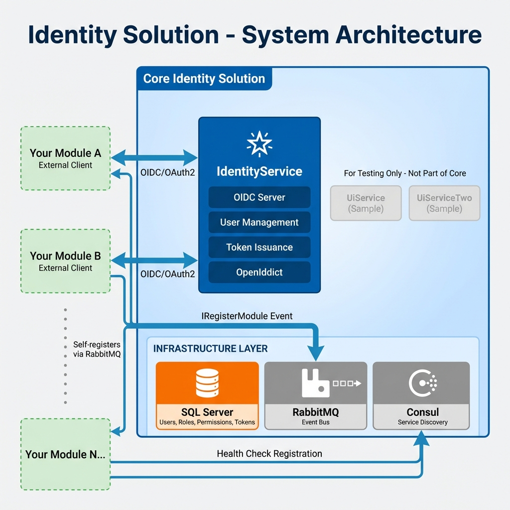
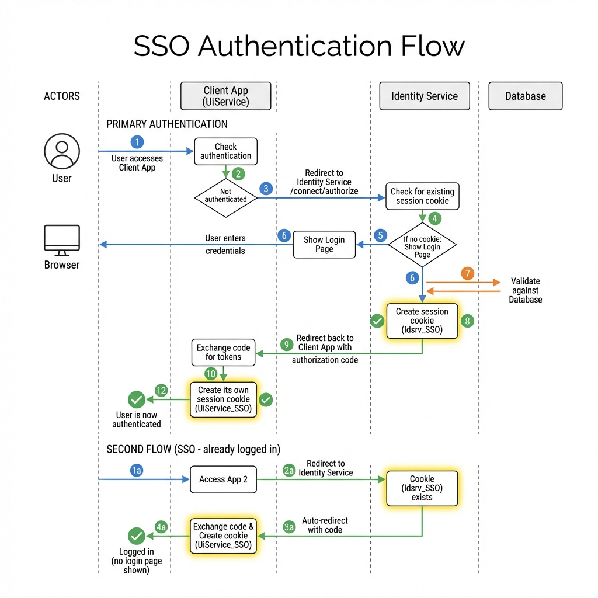
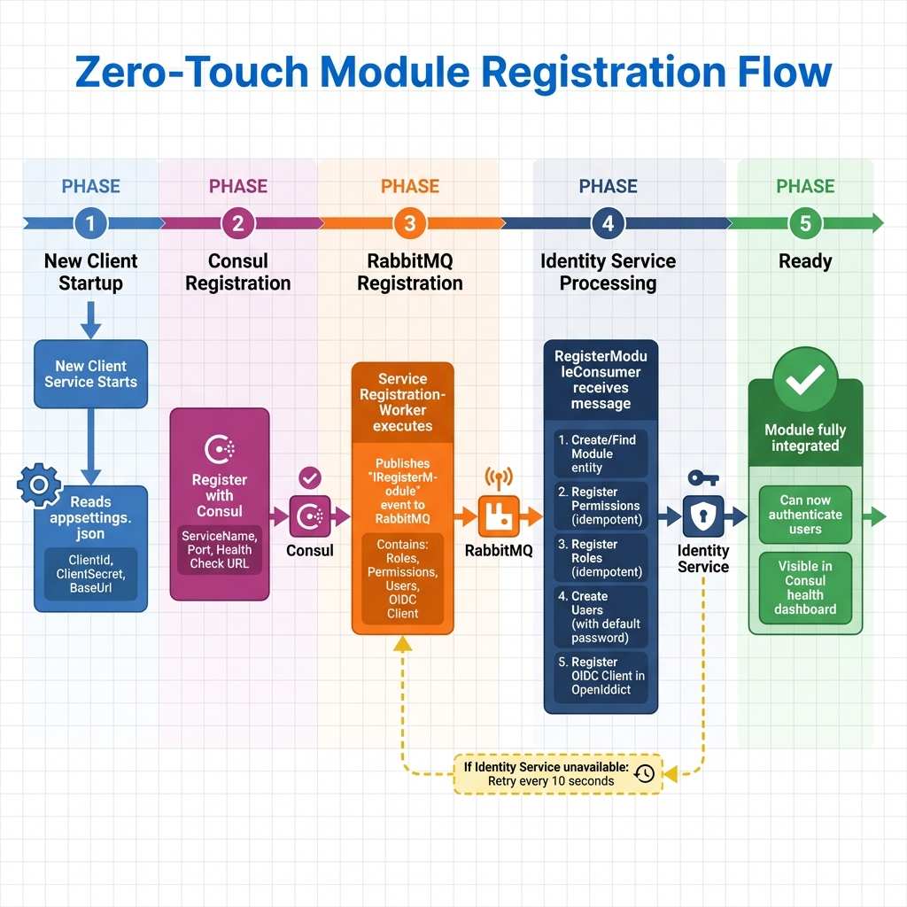
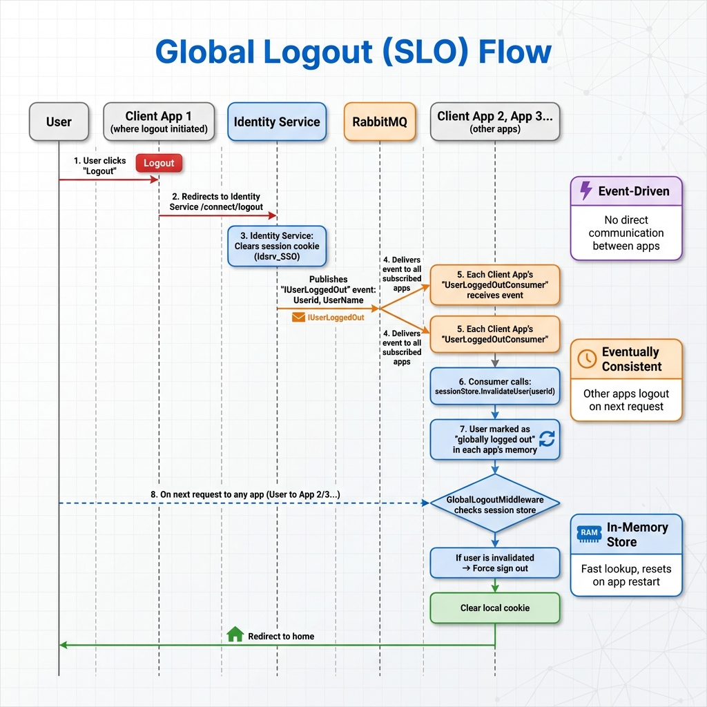

# Identity Solution & User Management System

This repository provides a centralized **Identity and Access Management (IAM)** solution built with **OpenIddict**, **ASP.NET Core Identity**, and **MassTransit**. It supports **Single Sign-On (SSO)**, **Single Logout (SLO)**, and **Service Discovery** via Consul.

---

## 📋 Table of Contents

- [Architecture Overview](#️-architecture-overview)
- [Architecture Diagrams](#-architecture-diagrams)
- [Infrastructure Requirements](#-infrastructure-requirements)
- [Project Structure](#-project-structure)
- [Getting Started](#-getting-started)
- [Connecting a New Service](#-connecting-a-new-service-zero-touch-integration)
- [Naming Conventions & Rules](#-naming-conventions--rules)
- [Configuration Reference](#️-configuration-reference)
- [Available Events](#-list-of-available-events)
- [Global Logout (SLO)](#-global-logout-single-logout---slo)
- [Production Deployment](#-production-deployment)
- [Troubleshooting](#️-technical-details--troubleshooting)

---

## 🏗️ Architecture Overview

### System Architecture Diagram



**Core Identity Solution** (shown in blue border):
- **IdentityService**: Central OIDC provider using OpenIddict - handles authentication, token issuance, and user management
- **Infrastructure**: SQL Server (data), RabbitMQ (events), Consul (service discovery)

**External Client Applications** (shown with dashed green borders):
- Your own applications connect as OIDC clients
- They self-register automatically via RabbitMQ
- Any number of client apps can plug in

> ⚠️ The sample apps (UiService, UiServiceTwo) shown grayed out are for testing only - they are NOT part of the core solution.

<details>
<summary>📊 View ASCII Diagram</summary>

```
┌─────────────────────────────────────────────────────────────────────────┐
│                         Identity Solution                                │
├─────────────────────────────────────────────────────────────────────────┤
│                                                                         │
│  ┌──────────────────┐     ┌──────────────────┐     ┌─────────────────┐ │
│  │  IdentityService │     │   UiService.Web  │     │ UiServiceTwo.Web│ │
│  │   (OIDC Server)  │     │   (Client App)   │     │  (Client App)   │ │
│  │   Port: 7242     │     │   Port: 7150     │     │   Port: 7160    │ │
│  └────────┬─────────┘     └────────┬─────────┘     └────────┬────────┘ │
│           │                        │                         │          │
│           └────────────────────────┼─────────────────────────┘          │
│                                    │                                    │
│  ┌─────────────────────────────────▼─────────────────────────────────┐ │
│  │                        RabbitMQ (Event Bus)                        │ │
│  │  - User events (login/logout)                                      │ │
│  │  - Module registration                                             │ │
│  │  - Role/Permission/User sync                                       │ │
│  └────────────────────────────────────────────────────────────────────┘ │
│                                    │                                    │
│  ┌─────────────────────────────────▼─────────────────────────────────┐ │
│  │                      Consul (Service Discovery)                    │ │
│  │  - Health checks                                                   │ │
│  │  - Dynamic service registration                                    │ │
│  │  - Module synchronization                                          │ │
│  └────────────────────────────────────────────────────────────────────┘ │
│                                    │                                    │
│  ┌─────────────────────────────────▼─────────────────────────────────┐ │
│  │                      SQL Server (Database)                         │ │
│  │  - Users, Roles, Permissions                                       │ │
│  │  - OpenIddict tokens & applications                                │ │
│  │  - Modules                                                         │ │
│  └────────────────────────────────────────────────────────────────────┘ │
│                                                                         │
└─────────────────────────────────────────────────────────────────────────┘
```

</details>

---

## 📊 Architecture Diagrams

### SSO Authentication Flow
Shows how Single Sign-On works - first login vs. subsequent app access:



### Zero-Touch Module Registration
How new services self-register with the Identity system:



### Global Logout (SLO) Flow
Event-driven logout propagation across all applications:



---

## 🔧 Infrastructure Requirements

This solution requires the following infrastructure components to be running:

### 1. **SQL Server**
- **Purpose**: Stores users, roles, permissions, OpenIddict applications, and tokens.
- **Default Connection**: `Server=.\sqlexpress;Database=IdentitySolution`
- **Required by**: IdentityService.Web

### 2. **RabbitMQ**
- **Purpose**: Message broker for event-driven communication between services.
- **Default Host**: `localhost:5672`
- **Management UI**: `http://localhost:15672` (guest/guest)
- **Required by**: All services

**Events Published:**
| Event | Publisher | Purpose |
|-------|-----------|---------|
| `IRegisterModule` | Client Services | Auto-registers OIDC clients, roles, permissions |
| `IUserLoggedIn` | IdentityService | Broadcasts login events |
| `IUserLoggedOut` | IdentityService | Triggers global logout |
| `IUserCreated/Updated` | IdentityService | Syncs user changes |
| `IRoleCreated/Updated` | IdentityService | Syncs role changes |
| `IPermissionCreated/Updated` | IdentityService | Syncs permission changes |

### 3. **Consul**
- **Purpose**: Service discovery and health monitoring.
- **Default Address**: `http://localhost:8500`
- **UI**: `http://localhost:8500/ui`
- **Required by**: All services

**Features:**
- Automatic service registration on startup
- Health check monitoring every 10 seconds
- Auto-deregistration after 1 minute of failed health checks
- Dynamic IdentityService authority resolution

### Quick Start (Docker Compose)
```yaml
version: '3.8'
services:
  rabbitmq:
    image: rabbitmq:3-management
    ports:
      - "5672:5672"
      - "15672:15672"
  
  consul:
    image: consul:latest
    ports:
      - "8500:8500"
    command: agent -dev -client=0.0.0.0

  sqlserver:
    image: mcr.microsoft.com/mssql/server:2022-latest
    environment:
      SA_PASSWORD: "YourStrong@Passw0rd"
      ACCEPT_EULA: "Y"
    ports:
      - "1433:1433"
```

---

## 📁 Project Structure

### Core Solution (Identity Provider)
```
IdentitySolution/
├── src/
│   ├── IdentityService.Web/              # ⭐ Central OIDC Provider (OpenIddict Server)
│   ├── IdentityService.Domain/           # ⭐ Domain entities (User, Role, Permission, Module)
│   ├── IdentityService.Application/      # ⭐ Application interfaces
│   ├── IdentityService.Infrastructure/   # ⭐ EF Core, MassTransit consumers, OpenIddict config
│   │
│   ├── IdentitySolution.Shared/          # ⭐ Shared DTOs and Event interfaces
│   │   ├── Events/                       # Message contracts (IUserLoggedOut, IRegisterModule, etc.)
│   │   └── Models/                       # DTOs (RoleDto, PermissionDto, UserDto, OidcClientDto)
│   │
│   └── IdentitySolution.ServiceDiscovery/ # ⭐ Consul extensions and helpers
│
└── README.md
```

### Sample Client Applications (For Testing/Reference Only)
```
IdentitySolution/
├── src/
│   ├── UiService.Web/                    # 📋 Sample MVC client (demonstrates SSO integration)
│   ├── UiServiceTwo.Web/                 # 📋 Second sample client (demonstrates multi-app SSO)
│   └── RecoveryProject.Sample/           # 📋 M2M client sample (client credentials flow)
```

> ⚠️ **Important**: The sample client applications (`UiService.Web`, `UiServiceTwo.Web`, `RecoveryProject.Sample`) are **NOT part of the core Identity Solution**. They are included only for testing and as reference implementations. Your own applications will connect to this Identity Solution as external OIDC clients.

---

## 🚀 Getting Started

### Prerequisites
1. .NET 8 SDK
2. SQL Server (LocalDB, Express, or full)
3. RabbitMQ
4. Consul

### 1. Start Infrastructure
```bash
# Start RabbitMQ
docker run -d --name rabbitmq -p 5672:5672 -p 15672:15672 rabbitmq:3-management

# Start Consul
docker run -d --name consul -p 8500:8500 consul agent -dev -client=0.0.0.0
```

### 2. Update Connection Strings
Edit `appsettings.json` in each project to match your SQL Server instance.

### 3. Run the Services
```bash
# Terminal 1 - Identity Service
cd src/IdentityService.Web
dotnet run

# Terminal 2 - UI Service
cd src/UiService.Web
dotnet run

# Terminal 3 - UI Service Two
cd src/UiServiceTwo.Web
dotnet run
```

### 4. Default Admin Credentials
- **Username**: `admin`
- **Password**: `Password123!`

---

## 🔌 Connecting a New Service (Zero-Touch Integration)

New services can self-register their OIDC clients, roles, and permissions dynamically without modifying the Identity Service.

### 1. Configure `appsettings.json`

```json
{
  "Logging": {
    "LogLevel": {
      "Default": "Information",
      "Microsoft.AspNetCore": "Warning"
    }
  },
  "CookieDomain": ".yourdomain.com",
  "ConnectionStrings": {
    "DefaultConnection": "Server=...;Database=...;..."
  },
  "IdentityClient": {
    "ClientId": "your-module-name",
    "ClientSecret": "your-module-secret",
    "BaseUrl": "https://your-module.yourdomain.com"
  },
  "Consul": {
    "Address": "http://localhost:8500",
    "ServicePort": 443,
    "ServiceName": "YourModuleName"
  },
  "RabbitMq": {
    "Host": "localhost",
    "Username": "guest",
    "Password": "guest"
  }
}
```

> 💡 **Note**: The IdentityService authority URL is automatically resolved via Consul service discovery. You don't need to configure `IdentityServer:Authority` manually.

### 2. Implement `ServiceRegistrationWorker`

```csharp
public class ServiceRegistrationWorker : BackgroundService
{
    protected override async Task ExecuteAsync(CancellationToken stoppingToken)
    {
        // Define module-specific data
        var roles = new List<RoleDto>
        {
            new RoleDto { Name = "YourModuleManager", Description = "Manager role for your module" }
        };

        var permissions = new List<PermissionDto>
        {
            new PermissionDto { Name = "yourmodule.read", Module = "YourModule", Description = "Read access" },
            new PermissionDto { Name = "yourmodule.write", Module = "YourModule", Description = "Write access" }
        };

        var users = new List<UserDto>
        {
            new UserDto { UserName = "moduleadmin", Email = "admin@yourmodule.com", FullName = "Module Admin" }
        };

        var configSection = _configuration.GetSection("IdentityClient");
        var baseUrl = configSection["BaseUrl"];

        var oidcClients = new List<OidcClientDto>
        {
            new OidcClientDto
            {
                ClientId = configSection["ClientId"],
                ClientSecret = configSection["ClientSecret"],
                DisplayName = "Your Module Display Name",
                RedirectUris = { $"{baseUrl}/signin-oidc" },
                PostLogoutRedirectUris = { $"{baseUrl}/signout-callback-oidc" },
                HealthCheckUrl = $"{baseUrl}/health"
            }
        };

        // Retry until IdentityService is available
        while (!stoppingToken.IsCancellationRequested)
        {
            try
            {
                using var scope = _scopeFactory.CreateScope();
                var registrationService = scope.ServiceProvider.GetRequiredService<IModuleRegistrationService>();
                await registrationService.RegisterAsync(roles, permissions, users, oidcClients);
                _logger.LogInformation("Module registration successful.");
                break;
            }
            catch (Exception ex)
            {
                _logger.LogWarning("Registration failed. Retrying in 10s... Error: {Message}", ex.Message);
                await Task.Delay(10000, stoppingToken);
            }
        }
    }
}
```

### 3. Register Required Services in `Program.cs`

```csharp
// Add Consul configuration
builder.Services.AddConsulConfig(builder.Configuration);

// Add module registration service
builder.Services.AddScoped<IModuleRegistrationService, ModuleRegistrationService>();

// Add the background worker
builder.Services.AddHostedService<ServiceRegistrationWorker>();

// Add MassTransit for event messaging
builder.Services.AddMassTransit(x =>
{
    x.SetKebabCaseEndpointNameFormatter();
    x.AddConsumer<UserLoggedOutConsumer>();
    x.AddConsumer<UserLoggedInConsumer>();

    x.UsingRabbitMq((context, cfg) =>
    {
        var rabbitMqHost = builder.Configuration["RabbitMq:Host"] ?? "localhost";
        cfg.Host(rabbitMqHost);
        cfg.ConfigureEndpoints(context);
    });
});

// Enable health checks
builder.Services.AddHealthChecks();

// ... after app.Build()

// Use Consul service discovery
app.UseConsul();

// Map health endpoint
app.MapHealthChecks("/health");
```

---

## 📏 Naming Conventions & Rules

### Module Registration

| Entity | Naming Convention | Example |
|--------|-------------------|---------|
| **ClientId** | Lowercase, matches module name | `recovery`, `loams`, `nursing` |
| **Consul ServiceName** | PascalCase, matches module | `Recovery`, `LOAMS`, `Nursing` |
| **Module Name** | PascalCase | `Recovery`, `LOAMS`, `Nursing` |
| **Permissions** | `module.action` format, lowercase | `recovery.dashboard`, `loams.facilitysetup` |
| **Roles** | PascalCase with module prefix | `RecoveryManager`, `LOAMSApprover` |

### Configuration Keys

| Key | Purpose | Example |
|-----|---------|---------|
| `IdentityClient:ClientId` | OIDC Client ID | `recovery` |
| `IdentityClient:ClientSecret` | OIDC Client Secret | `recovery-secret` |
| `IdentityClient:BaseUrl` | External URL of the service | `https://recovery.example.com` |
| `IdentityServer:Authority` | Fallback IdentityService URL | `https://identity.example.com` |
| `Consul:ServiceName` | Service name in Consul | `Recovery` |
| `Consul:ServicePort` | Port for health checks | `443` |
| `CookieDomain` | Shared cookie domain for SSO | `.example.com` |

### Registration Rules

1. **Idempotent Registration**: All registration operations are idempotent. Re-registering an existing entity will not create duplicates.

2. **Module Auto-Creation**: If a module doesn't exist, it will be created automatically during registration.

3. **Permission Format**: Use `module.action` format. The module part is extracted for grouping:
   ```csharp
   Name = "recovery.approve",   // Full permission name
   Module = "Recovery"          // Module grouping
   ```

4. **OIDC Client Permissions**: All registered clients automatically receive these OpenIddict permissions:
   - `ept:authorization`, `ept:logout`, `ept:token`
   - `gt:authorization_code`, `gt:refresh_token`
   - `rst:code`
   - `scp:email`, `scp:profile`, `scp:roles`, `scp:openid`, `scp:api`

5. **Default User Password**: Users created via registration get a default password: `DefaultPassword123!`

6. **Health Check URL**: Always use `/health` as the health check path.

7. **Service ID Format**: Consul service IDs follow the pattern: `{ServiceName}-{Port}`

---

## ⚙️ Configuration Reference

### Minimal `appsettings.json` for Client Service

```json
{
  "CookieDomain": ".yourdomain.com",
  "IdentityClient": {
    "ClientId": "your-client-id",
    "ClientSecret": "your-client-secret",
    "BaseUrl": "https://your-service.yourdomain.com"
  },
  "Consul": {
    "Address": "http://consul-server:8500",
    "ServicePort": 443,
    "ServiceName": "YourService"
  },
  "RabbitMq": {
    "Host": "rabbitmq-server",
    "Username": "guest",
    "Password": "guest"
  }
}
```

> 💡 The `IdentityServer:Authority` is automatically resolved via Consul. No manual configuration needed.

### IdentityService `appsettings.json`

```json
{
  "CookieDomain": ".yourdomain.com",
  "ConnectionStrings": {
    "DefaultConnection": "Server=...;Database=XmartIdentity;..."
  },
  "IdentityClient": {
    "BaseUrl": "https://identity.yourdomain.com"
  },
  "Consul": {
    "Address": "http://consul-server:8500",
    "ServicePort": 443,
    "ServiceName": "IdentityService"
  },
  "RabbitMq": {
    "Host": "rabbitmq-server",
    "Username": "guest",
    "Password": "guest"
  }
}
```

---

## 📩 List of Available Events

| Event | Source | Purpose |
|-------|--------|---------|
| `IUserLoggedIn` | IdentityService | Broadcasts when a user successfully logs in |
| `IUserLoggedOut` | IdentityService | Broadcasts when a user logs out (triggers global logout) |
| `IUserCreated` | IdentityService | Broadcasts when a new user is created |
| `IUserUpdated` | IdentityService | Broadcasts when user details are modified |
| `IRoleCreated` | IdentityService | Broadcasts when a new role is created |
| `IRoleUpdated` | IdentityService | Broadcasts when a role is modified |
| `IPermissionCreated` | IdentityService | Broadcasts when a new permission is created |
| `IPermissionUpdated` | IdentityService | Broadcasts when a permission is modified |
| `IRegisterModule` | Client Services | Sent on startup to register the client with IdentityService |

---

## 🔄 Global Logout (Single Logout - SLO)

To ensure logging out of one application signs out all applications:

### 1. Implement the Consumer

```csharp
public class UserLoggedOutConsumer : IConsumer<IUserLoggedOut>
{
    private readonly IGlobalSessionStore _sessionStore;

    public async Task Consume(ConsumeContext<IUserLoggedOut> context)
    {
        _sessionStore.InvalidateUser(context.Message.UserId);
    }
}
```

### 2. Add Global Logout Middleware

```csharp
public class GlobalLogoutMiddleware
{
    public async Task InvokeAsync(HttpContext context, IGlobalSessionStore sessionStore)
    {
        if (context.User.Identity?.IsAuthenticated == true)
        {
            var userId = context.User.FindFirst(ClaimTypes.NameIdentifier)?.Value;
            if (userId != null && sessionStore.IsUserInvalidated(userId))
            {
                await context.SignOutAsync(CookieAuthenticationDefaults.AuthenticationScheme);
                context.Response.Redirect("/");
                return;
            }
        }
        await _next(context);
    }
}
```

### 3. Register in Pipeline

```csharp
app.UseMiddleware<GlobalLogoutMiddleware>();
app.UseAuthentication();
app.UseAuthorization();
```

---

## 🌐 Production Deployment

### Reverse Proxy Configuration

When running behind a reverse proxy (nginx, IIS ARR, etc.), ensure it forwards these headers:

**nginx example:**
```nginx
location / {
    proxy_pass http://backend;
    proxy_set_header Host $host;
    proxy_set_header X-Forwarded-For $proxy_add_x_forwarded_for;
    proxy_set_header X-Forwarded-Proto $scheme;
    proxy_set_header X-Forwarded-Host $host;
}
```

### Environment Variables

```bash
ASPNETCORE_ENVIRONMENT=Production
```

### Data Protection Keys

For SSO to work across multiple instances:

1. All services must share the same Data Protection keys
2. Keys are stored in the `Keys` folder within each service's base directory
3. **Manual sync required**: Copy the XML key files from one instance to all others

⚠️ **Warning**: If keys don't match exactly, SSO will fail!

### Cookie Configuration

All services must use:
- Same `CookieDomain` (e.g., `.xmartpoint.com`)
- `SameSite=None` with `Secure=true`
- HTTPS only

---

## 🛠️ Technical Details & Troubleshooting

### Common Issues

| Issue | Solution |
|-------|----------|
| **Too Many Redirects** | Ensure ForwardedHeaders middleware is configured and proxy sends `X-Forwarded-*` headers |
| **SSO Not Working** | Verify Data Protection keys are synced across all services |
| **Consul Connection Failed** | Check Consul agent is running at the configured address |
| **Module Not Registered** | Check RabbitMQ connection and consumer logs |
| **OIDC Discovery Error** | Verify `IdentityServer:Authority` is accessible from the client |

### Logging

All services use Serilog with:
- Console output (development)
- File output: `logs/{service-name}-.txt` (rolling daily)

### Health Check Endpoints

| Service | Endpoint | Checks |
|---------|----------|--------|
| IdentityService | `/health` | Database connectivity |
| UiService | `/health` | Basic availability |
| UiServiceTwo | `/health` | Basic availability |

### Technology Stack

| Component | Technology |
|-----------|------------|
| Framework | .NET 8 |
| Identity | ASP.NET Core Identity |
| OIDC Server | OpenIddict 5.8 |
| Database | SQL Server + Entity Framework Core 8 |
| Messaging | MassTransit + RabbitMQ |
| Service Discovery | Consul |
| Logging | Serilog |

---

## 📝 License

This project is proprietary software. All rights reserved.
