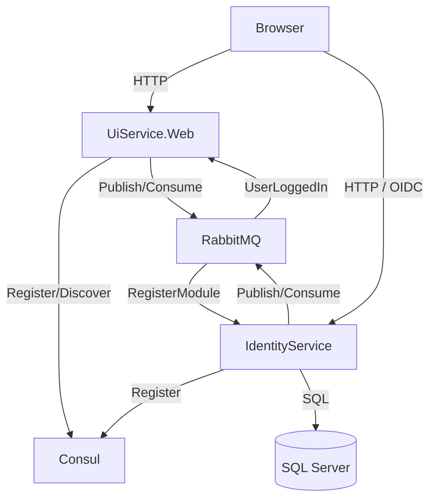

# Complete System Architecture & Operational Flow

This document details the end-to-end lifecycle of the solution, from service startup and discovery to user authentication and real-time session synchronization.

## 1. High-Level Architecture
The solution follows a distributed microservices pattern:
- **IdentityService**: The central Authority (IDP) and Data Store. Uses **OpenIddict**.
- **UiService(s)**: Client Web Applications (Consumers).
- **Consul**: Service Discovery & Health Checking.
- **RabbitMQ**: Asynchronous Message Bus for events (Registration, Login Events).
- **SignalR**: Real-time push notifications to browsers.

---

## 2. Phase 1: Startup & Service Discovery
This phase ensures that all services are visible and that the Identity Service knows about the Clients (OAuth consumers).

### Step 1.1: Service Boot & Consul Registration
**Component**: `IdentitySolution.ServiceDiscovery`
**Method**: `app.UseConsul()`

1.  When any service (UI or IDP) starts, it reads its configuration (e.g., `Consul:ServiceName`, `Consul:ServicePort`).
2.  It sends a registration payload to the **Consul Agent** running on `localhost:8500`.
3.  It registers a **Health Check** endpoint (`/health`) which Consul polls every 10 seconds.
4.  On shutdown (`ApplicationStopping`), it deregisters itself.

### Step 1.2: Module Registration (Seeding Data)
**Component**: `UiService.Web.Workers.ServiceRegistrationWorker`

Instead of manually configuring Clients and Roles in the Database, the **Client Apps** tell the **Identity Service** what they need.

1.  **Worker Loop**: On startup, a generic `BackgroundService` runs.
2.  **Definition**: It constructs a DTO containing:
    *   **Roles**: e.g., "UiManager"
    *   **Permissions**: e.g., "ui.view.dashboard"
    *   **Users**: Default seed users (e.g., "uisupervisor")
    *   **OIDC Client**: ClientId (`ui-client`), Secret, Redirect URIs (`/signin-oidc`).
3.  **Publication**: It publishes an `IRegisterModule` event to **RabbitMQ**.
    *   *Retry Policy*: If RabbitMQ is down, it retries every 10 seconds.

### Step 1.3: Identity Service Processing
**Component**: `IdentityService.Infrastructure.Consumers.RegisterModuleConsumer`

1.  **Consumption**: The IDP listens for `IRegisterModule`.
2.  **Idempotent Execution**:
    *   **Permissions**: Checks if they exist in DB; executes `INSERT` if missing.
    *   **Roles**: Checks `RoleManager`; creates if missing.
    *   **Users**: Checks `UserManager`; creates if missing with default password.
    *   **OIDC Clients**: Uses `IOpenIddictApplicationManager` to check for `ui-client`. If missing, it creates a **Confidential Client** entry with Authorization Code flow enabled.
3.  **Result**: The system auto-configures itself. You can add a new Microservice, and it will "install" itself into the Identity Provider automatically.

---

## 3. Phase 2: OIDC Authentication (The Login Flow)
This is the standard process for a user accessing a secured resource.

### Step 2.1: The Challenge
1.  User clicks "Login" or accesses `[Authorize]` route on **UiService**.
2.  **OIDC Middleware** (`Program.cs`) intercepts the request.
3.  It constructs an Authorize URL:
    *   `https://localhost:7242/connect/authorize`
    *   `client_id=ui-client`
    *   `response_type=code`
    *   `scope=openid profile email roles`
    *   `redirect_uri=.../signin-oidc`
4.  Browser redirects to **IdentityService**.

### Step 2.2: The Authentication
1.  **IdentityService** displays the Login Page (`/Account/Login`).
2.  User enters credentials.
3.  **IdentityService** validates credentials against SQL Database (`AspNetCoreUsers`).
4.  Cookies are set on `localhost:7242` (`Identity.Global.Session`).

### Step 2.3: The Callback
1.  **IdentityService** redirects browser back to **UiService** (`/signin-oidc`) with an `code`.
2.  **UiService** (Back-channel) swaps the `code` for an `access_token` and `id_token`.
3.  **UiService** creates its own local session cookie (`SSO.Cookie`) and signs the user in.

---

## 4. Phase 3: Global Login Synchronization (Real-Time)
This advanced phase solves the "Refresh Problem" where logging in on one tab doesn't reflect on others.

### Step 4.1: The Trigger
**File**: `IdentityService.../Login.cshtml.cs`

1.  User succeeds in Step 2.2.
2.  IdentityService publishes `IUserLoggedIn` event to **RabbitMQ**.

### Step 4.2: The Broadcast
**File**: `UiService.../Consumers/UserLoggedInConsumer.cs`

1.  **UiService** receives the event.
2.  It performs a **Dual-Broadcast** via **SignalR**:
    *   **Targeted**: `Clients.User(UserId).Send("UserLoggedIn")`. Hits authenticated tabs.
    *   **Anonymous**: `Clients.All.Send("CheckSession")`. Hits login pages/landing pages.

### Step 4.3: The Client Decision
**File**: `_Layout.cshtml`

1.  Browser receives signal.
2.  **Logic**:
    *   Are we anonymous? (`isAuthenticated == false`)
    *   **Yes** -> Create Hidden Iframe to `/Account/SilentLogin`.

### Step 4.4: The Silent Handshake
**File**: `AccountController.cs` (SilentLogin)

1.  Iframe requests `/Account/SilentLogin`.
2.  Controller triggers OIDC Challenge with `prompt=none`.
3.  **Scenario: Valid Session**:
    *   Request: `IdentityService/connect/authorize?prompt=none...`
    *   IdentityService sees valid cookie from Step 2.2.
    *   IdentityService returns `code` immediately (No UI).
    *   Iframe authenticates + redirects parent window to Dashboard.
4.  **Scenario: Invalid Session (Stranger)**:
    *   IdentityService sees NO cookie.
    *   `prompt=none` forbids Login UI to be shown.
    *   IdentityService returns `error=login_required`.
    *   Iframe stops. User is undisturbed.

---

## 5. Summary of Technologies

| Layer | specific Tech | Role |
| :--- | :--- | :--- |
| **Frontend** | Razor, jQuery, SignalR JS | UI Rendering & Real-time Client |
| **Backend API** | ASP.NET Core 8 | Business Logic |
| **Identity** | ASP.NET Identity + OpenIddict | Auth Server & Token Service |
| **Database** | EF Core + SQL Server | Persistence |
| **Messaging** | MassTransit + RabbitMQ | Decoupled Event Bus |
| **Discovery** | Consul | Service Registry |
| **Transport** | SignalR (WebSockets) | Server-to-Client Push |
