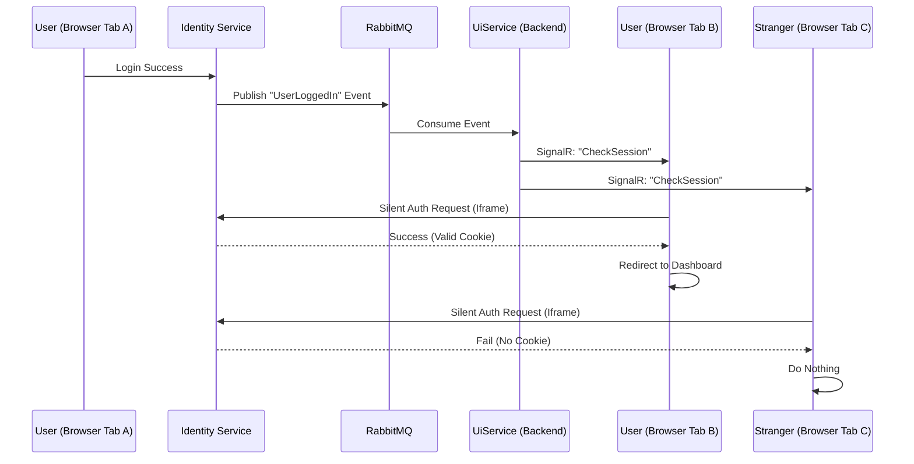

# Global Login Synchronization: A Deep Dive

This document details the architectural solution for synchronizing login states across multiple web applications and browser tabs in real-time. It explains how a user logging in on one device or tab automatically triggers a login/redirect on other active tabs **only for that specific user**, while leaving anonymous users undisturbed.

## 1. The Core Problem
In a distributed microservice architecture with a central Identity Provider (IDP):
1.  **Distributed State**: Creating a session on the IDP (IdentityService) does not automatically create a session on the Client Apps (UiService).
2.  **The "Refresh" Issue**: Client Apps don't know the user has logged in until the user manually refreshes the page or navigates to a protected route.
3.  **The "Broadcasting" Risk**: If we simply tell all apps "Refresh now!", we disrupt every other user on the system (e.g., anonymous users browsing the landing page), causing forced reloads or failed redirects.

## 2. The Solution Architecture
The solution uses an **Event-Driven Architecture** combined with **Real-Time WebSockets (SignalR)** and **OIDC Silent Authentication**.

### High-Level Data Flow


---

## 3. Step-by-Step Technical Walkthrough

### Step 1: The Trigger (IdentityService)
**File**: `IdentityService.Api/Pages/Account/Login.cshtml.cs`

When the user successfully enters their credentials, the Identity Service needs to announce this fact to the world.

*   **Mechanism**: MassTransit (`IPublishEndpoint`).
*   **Action**: We publish an `IUserLoggedIn` event containing the `UserId`.
*   **Code**:
    ```csharp
    await _publishEndpoint.Publish<IUserLoggedIn>(new { UserId = user.Id, ... });
    ```
*   **Why**: This decouples the Identity Provider from the UI apps. The IDP doesn't know who is listening; it just shouts "Login happened!".

### Step 2: The Consumer (UiService Backend)
**File**: `UiService.Web/Consumers/UserLoggedInConsumer.cs`

The Web App acts as a bridge. It listens to the backend Message Bus and forwards relevant information to the frontend via SignalR.

*   **Logic**: It performs two distinct actions when it hears the message:
    1.  **Targeted Notification**: `Clients.User(UserId).SendAsync("UserLoggedIn")`
        *   This targets connections where the socket is *already identified* as that specific user. (e.g., The user is logged in on one tab but doing something else).
    2.  **Broadcast Notification**: `Clients.All.SendAsync("CheckSession")`
        *   This is the critical part. We send a generic "Ping" to **every single open connection** (anonymous or not). It effectively asks: *"Someone logged in. Is it you?"*

### Step 3: The Filter (Frontend JavaScript)
**File**: `UiService.Web/Views/Shared/_Layout.cshtml`

The intelligence to distinguish "User A" from "User B" lives in the browser, inside the `_Layout.cshtml`.

*   **The Guard**: We inject the current authentication state into a JavaScript variable on page load.
    ```javascript
    var isAuthenticated = @(User.Identity?.IsAuthenticated.ToString().ToLower());
    ```
*   **The Listener**: When the `CheckSession` signal arrives:
    *   **If `isAuthenticated` is true**: The script ignores the message. The user is already logged in; no action is needed.
    *   **If `isAuthenticated` is false (Anonymous)**: The script suspects this *might* be the user who just logged in on another tab. It initiates the **Silent Login Protocol**.

### Step 4: The Silent Check (The "CheckSession" Iframe)
**File**: `UiService.Web/Views/Shared/_Layout.cshtml` (JS Logic) & `UiService.Web/Controllers/AccountController.cs`

This is the most complex mechanism. We need to check if the user is logged in at the Identity Service **without** redirecting the page (which would disrupt the user if they are actually a stranger).

1.  **The Hidden Mainframe**: The JS creates an invisible `<iframe>` pointing to `/Account/SilentLogin`.
2.  **The Controller Action**:
    ```csharp
    public IActionResult SilentLogin() {
        var props = new AuthenticationProperties { ... };
        props.Items["prompt"] = "none"; // <--- CRITICAL
        return Challenge(props, OpenIdConnectDefaults.AuthenticationScheme);
    }
    ```
3.  **The `prompt=none` Parameter**: This is an OIDC standard parameter. It tells the Identity Provider:
    *   *"If the user has a valid session cookie, log them in silently."*
    *   *"If the user does NOT have a session, return an error immediately. **DO NOT show a login page**."*

### Step 5: The Outcome (IdentityService Decision)

This request hits the IDP (localhost:7242). The browser automatically sends cookies associated with that domain.

#### Scenario A: The User (You)
*   You logged in on Tab 1, so your browser **has** the IdentityService session cookie.
*   IdentityService sees the cookie and the `prompt=none` request.
*   **State**: Valid Session.
*   **Action**: IdentityService issues an authorization code and redirects the Iframe back to the Client App (`/signin-oidc`).
*   **Result**: The Client App exchanges the code for tokens and establishes a **local** session cookie inside the Iframe.
*   **The Callback**: The Iframe loads `/Account/SilentLoginCallback`.
    *   **File**: `UiService.Web/Views/Account/SilentLoginCallback.cshtml`
    *   **Script**: `window.parent.location.href = '/Home/Dashboard';`
    *   **Effect**: The Iframe (which is now authenticated) forces the **Parent Window** (the main tab) to redirect to the Dashboard.

#### Scenario B: The Stranger (Anonymous)
*   They have **no** session cookie for IdentityService.
*   IdentityService sees `prompt=none` but no cookie.
*   **State**: Invalid Session.
*   **Action**: Because `prompt=none` forbids showing a UI, IdentityService returns an error (e.g., `login_required`) to the Iframe.
*   **Result**: The Iframe fails to load the clean callback. It stays on an error page (hidden). The parent window script sees nothing happen and eventually times out the Iframe. The user remains on the landing page, undisturbed.

## 4. Summary of Components

| Component | Responsibility | Key Logic |
| :--- | :--- | :--- |
| **IUserLoggedIn.cs** | Interface Event | Defines the contract `UserId`, `UserName`. |
| **Login.cshtml.cs** | Publisher | `_publishEndpoint.Publish(...)` after password success. |
| **UserLoggedInConsumer** | Processor | Sends `CheckSession` to **All** via SignalR. |
| **SignalR Hub** | Transport | Delivers the message to browsers. |
| **_Layout.cshtml (JS)** | Client Logic | Ignores if `isAuthenticated`. Else, spawns Iframe. |
| **AccountController** | OIDC Handshake | `SilentLogin` uses `prompt=none`. |
| **SilentLoginCallback** | Parent Redirect | `window.parent.location.href = ...` |

## 5. Why this is Robust
*   **Efficiency**: We don't hammer the Identity Provider. Only anonymous tabs *check* the session. Authenticated tabs ignore the ping.
*   **UX Protection**: "Strangers" never see a redirect or a refresh. Their specific browser session has no IDP cookie, so the silent check fails silently.
*   **Security**: We rely on standard OIDC cookies. We aren't passing tokens over SignalR or doing manual session handling.
